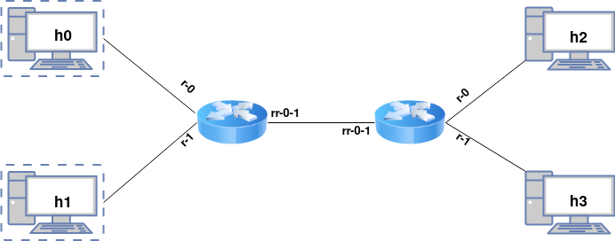

# Dataplane Router #

### **1. ARP** ###
ARP implementation has two parts: request and reply. If the router receives a request, then it sends a reply, that will contain the MAC adress of the interface that received the packet. During the forwarding process, if the destination MAC address in unknown,
then the router will send an ARP request and the packet we have will be added to a queue, so the router can process other packets while waiting for a reply. When it receives the reply, we go through the whole queue and send all packets that we can. For efficiency, I used a hashmap to store the MAC addresses.

### **2. Forwarding** ###

For the forwarding process, first check if the packet is valid: if checksum is correct and the TTL field is > 1. Else, send an error message.

If the packet is IPv4 only (does not have protocol on a higher level), then call ```forward_packet```. For IP packets, this will be called with best_route parameter set to NULL. Check the checksum and TTL. If the destination MAC address is not known, make an ARP request.

### **3. ICMP** ###

1. **Destination unreachable + time exceeded**. In the case there is no route to the destination, or the TTL <=, router sends an ICMP error message. At the end of the ICMP packet, copy the old IP header and 8 bytes of the data contained by the IP packet.
2. **ICMP reply**. If the ICMP packet has a router interface as destination, then send an ICMP reply. Copy id and sequence from echo request and copy data at the end.

### **4. Efficent LPM** ###
For the LPM algorithm, I implemented a **trie** data structure. A maximum of 32 operations will be made to find the next hop.

For more details, I added comments in the code.

## **5. Testing** ##

For automated testing, run ```./checker/checker.sh```.

To manually run routers and hosts, run ```sudo python3 checker/topo.py```. To start routers, run ```make run_router0``` and ```make run_router1``` in the terminal opened. **Mininet** needs to be installed for this to work.

The following topology will be created:

     
    

